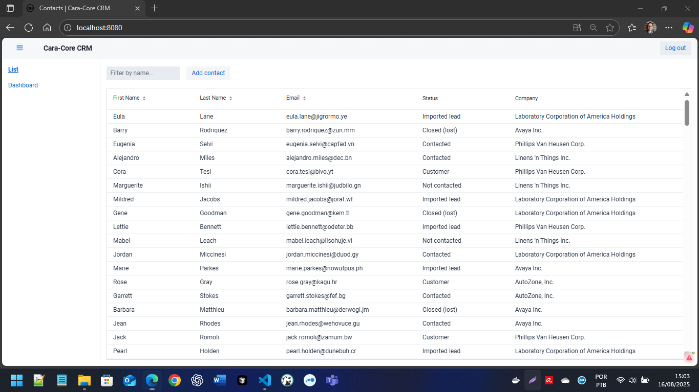

# CRM de Exemplo (Spring Boot + Vaadin)

Aplicação CRM construída com Spring Boot (back-end) e Vaadin (UI) como base para estudos e demonstrações.



Java alvo: Amazon Corretto OpenJDK 11

## Branches

- `main`: código-fonte com Vaadin 23
- `tomcat9_war`: código-fonte configurado para Tomcat 9 com Java 11

## Demo de Referência (Vaadin)
Exemplo oficial (não este repositório): [https://crm.demo.vaadin.com/login](https://crm.demo.vaadin.com/login)

## Tutorial Oficial
O tutorial em texto está disponível na [Documentação Vaadin](https://vaadin.com/docs/latest/flow/tutorials/in-depth-course).


## Banco de Dados (Docker Compose)
MySQL 8 é utilizado como banco principal. Suba o serviço:

```
docker compose up -d
```

Banco, usuário e senha serão criados automaticamente conforme definido em `docker-compose.yml`.

## Execução Local
1. Java 11 instalado (verifique `java -version`).
2. (Opcional) Suba MySQL via Docker Compose se for usar o profile padrão.
3. Inicie a aplicação:
    - Unix-like:
       ```bash
       ./mvnw spring-boot:run
       ```
    - Windows PowerShell:
       ```powershell
       ./mvnw.cmd spring-boot:run
       ```
4. Acesse: http://localhost:8080
5. Para rodar usando o profile docker dentro dos containers:
    ```bash
    docker compose up --build
    ```

### Perfis
| Profile | Objetivo | Banco |
|---------|----------|-------|
| (default) | Desenvolvimento usando MySQL local | MySQL |
| docker | Execução dentro dos containers | MySQL (service db) |
| test | Testes automatizados | H2 em memória |
| local | Ambiente alternativo local (MySQL) | MySQL |

## Autenticação
Credenciais padrão (ambiente de desenvolvimento):

Usuário: `user`  
Senha: `userpass`

Configuração em `SecurityConfig.java` (em memória).

## Aviso de Licença Vaadin
Mensagens como:

```
No license found when checking vaadin-chart
```
São emitidas no modo de desenvolvimento e podem ser ignoradas para este exemplo.

## Mapeamento Version (Major) Class File → Java

| Valor | Java |
|-------|------|
| 49    | 5    |
| 50    | 6    |
| 51    | 7    |
| 52    | 8    |
| 53    | 9    |
| 54    | 10   |
| 55    | 11   |
| 56    | 12   |
| 57    | 13   |
| 58    | 14   |
| 59    | 15   |
| 60    | 16   |
| 61    | 17   |
| 62    | 18   |
| 63    | 19   |
| 64    | 20   |
| 65    | 21   |

---
Seção de melhoria contínua: sinta-se à vontade para abrir issues ou PRs.